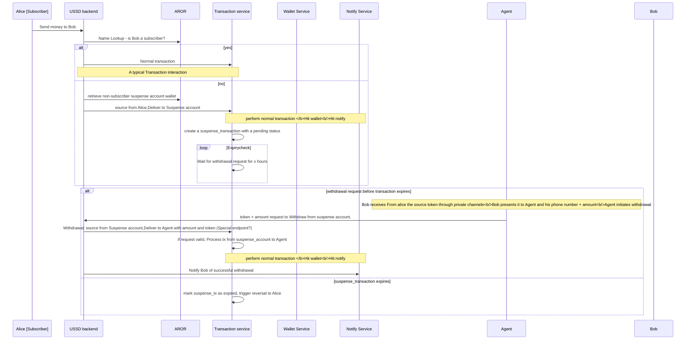

```mermaid
sequenceDiagram
    participant A as Alice [Subscriber]
    participant B as USSD backend
    participant C as AROR
    participant D as Transaction service
    participant E as Wallet Service
    participant F as Notify Service
    participant G as Agent
    participant H as Bob
    A->>B: Send money to Bob
    B->>C: Name Lookup - is Bob a subscriber?
alt yes
  B->>D: Normal transaction
  Note over B,D: A typical Transaction interaction
else no
   B->>C: retrieve non-subscriber suspense account wallet
   B->>D: source from Alice,Deliver to Suspense account
   Note over D,F: perform normal transaction </b>Hit wallet<b/>Hit notify
   D->>D: create a suspense_transaction with a pending status
 loop Expirycheck
       D->>D: Wait for withdrawal request for x hours
  end
end
alt withdrawal request before transaction expires
 note over G: Bob receives From alice the source token through private channels<b/>Bob presents it to Agent and his phone number + amount<b/>Agent initiates withdrawal
  G->>B: token + amount request to Withdraw from suspense account. 
  B->>D: Withdrawal: source from Suspense account,Deliver to Agent with amount and token (Special endpoint?)
  D->>D: if request valid, Process tx from suspense_account to Agent
  Note over D,F: perform normal transaction </b>Hit wallet<b/>Hit notify
  B->>F: Notify Bob of successful withdrawal
else suspense_transaction expires
   D->>D: mark suspense_tx as expired, trigger reversal to Alice
end
```