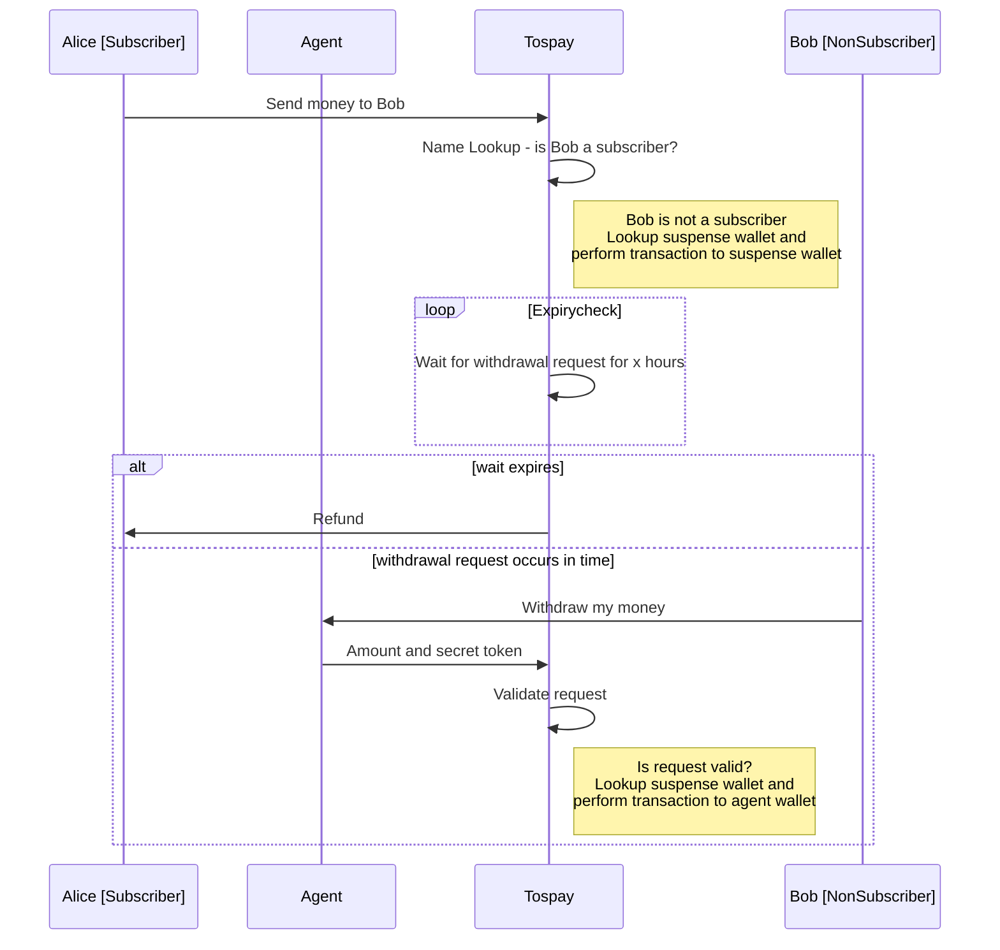

```mermaid
sequenceDiagram
    participant A as Alice [Subscriber]
    participant Agent
    participant Tospay
    participant B as Bob  [NonSubscriber]

    A->>Tospay: Send money to Bob
    Tospay->>Tospay: Name Lookup - is Bob a subscriber?
    Note right of Tospay: Bob is not a subscriber <br/>Lookup suspense wallet and <br/>perform transaction to suspense wallet <br/>
    loop Expirycheck
       Tospay->>Tospay: Wait for withdrawal request for x hours
    end
    alt wait expires
        Tospay->>A: Refund
    else withdrawal request occurs in time
        B->>Agent: Withdraw my money
        Agent->>Tospay: Amount and secret token
        Tospay->>Tospay: Validate request
    Note right of Tospay: Is request valid? <br/>Lookup suspense wallet and <br/>perform transaction to agent wallet <br/>
    end
   
```